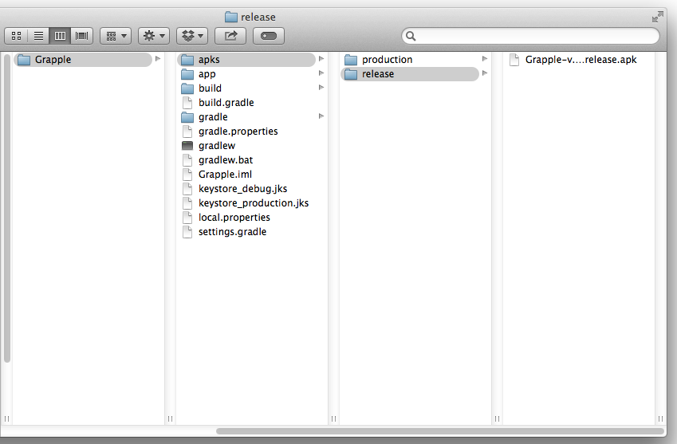
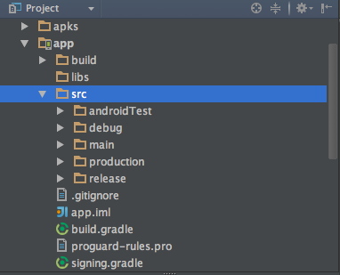

# Grapple
Grapple is a sample project to showcase how you can maintain a different build variants of your app.

It's useful if you want to keep track of e.g. build for developers, build for your client or a market release build.

Select a build variant and run a proper assemble Gradle task. To make your life easier `production` and `release` builds are renamed to match a `<project-name>-v.<version-name>-<build-type>.apk` pattern and placed in [apks] folder.

What's more every build variant has a different `applicationId` so you can have all of them installed on your device. It's handy especially for a client who can have a market version along with a developers version installed on his phone.

In the project you'll find corresponding folders to each build variant which allows to compile only the build-variant-depended source code.

The passwords of your release key and keystore are moved to a [separate file] which shouldn't be committed for security reasons. Also a sample debug keystore is committed which is a good practise.

The [build.gradle] defines three build variants:
 - debug - your own develop build,
 - production - can be a version for your client or some internal build,
 - release - market version build.
 
Learn more:
 - [Build System Overview]
 - [Configuring Gradle Builds]
 - [Signing Your Applications]
 - [Writing Build Scripts]
 
[apks]:https://github.com/MateuszMlodawski/Grapple/tree/master/apks
[separate file]:https://github.com/MateuszMlodawski/Grapple/blob/master/app/signing.gradle
[build.gradle]:https://github.com/MateuszMlodawski/Grapple/blob/master/app/build.gradle

[Build System Overview]:http://developer.android.com/sdk/installing/studio-build.html
[Configuring Gradle Builds]:https://developer.android.com/tools/building/configuring-gradle.html
[Signing Your Applications]:http://developer.android.com/tools/publishing/app-signing.html
[Writing Build Scripts]:https://www.gradle.org/docs/current/userguide/writing_build_scripts.html
